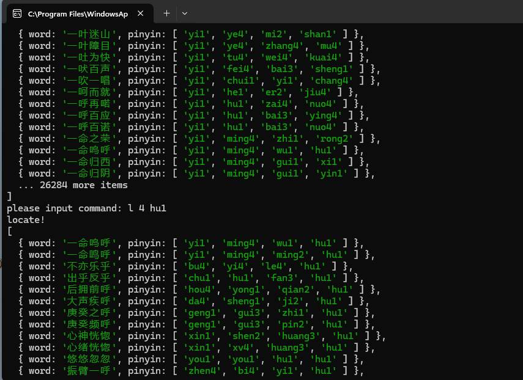

# handle-helper
“汉兜”成语游戏解谜工具
## 运行方式
```
pnpm install
pnpm start
```
## 命令
运行后会让你输入筛选命令，有以下两种命令:<br>
`l 位置 筛选条件`用于筛选指定位置的字的拼音符合筛选条件的成语<br>
`r 位置 筛选条件`用于排除指定位置的字的拼音符合筛选条件的成语<br>
`i 筛选条件`用于筛选在某个位置的字的拼音符合筛选条件的成语<br>
其中位置表示成语中字的位置1，2，3，4<br>
<br>
筛选条件可以是:<br>
- 全拼+声调 `ping1` <br>
- 全拼 `ping` <br>
- 声母 `p` <br>
- 韵母 `ing` <br>
- 声调如第一声 `1` <br>
## 例子
已知成语第二个字的拼音声母是f<br>
命令：`l 2 f` <br>
已知成语第三个字的声调不是第二声<br>
命令：`r 3 2` <br> 
已知成语中某个字的韵母是a<br>
命令：`i a` <br> 

## 图示

